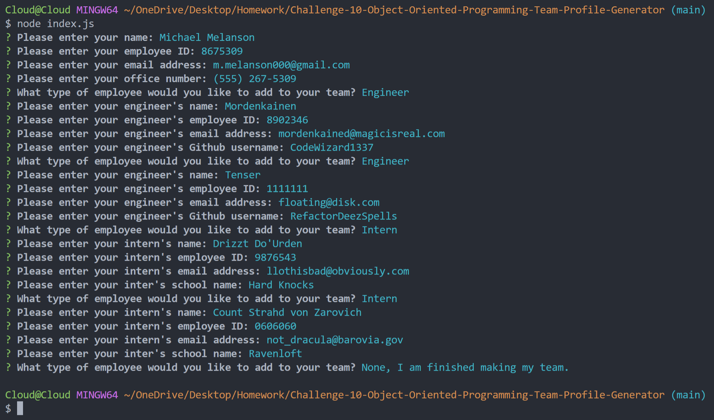
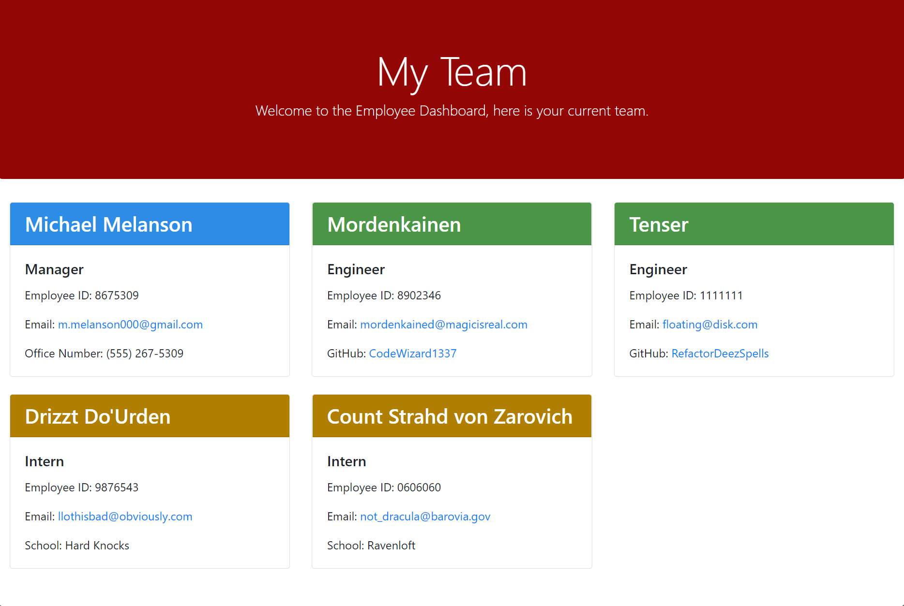

# Employee Dashboard Generator  
[](https://www.gnu.org/licenses/gpl-3.0)  

## Description  

The purpose of this is to allow a manager to enter their information as well as their employees, which will then be compiled into a viewable html dashboard.

**User Story**
```
AS A manager
I WANT to generate a webpage that displays my team's basic info
SO THAT I have quick access to their emails and GitHub profiles
```

**Acceptance Criteria**
```
GIVEN a command-line application that accepts user input
WHEN I am prompted for my team members and their information
THEN an HTML file is generated that displays a nicely formatted team roster based on user input
WHEN I click on an email address in the HTML
THEN my default email program opens and populates the TO field of the email with the address
WHEN I click on the GitHub username
THEN that GitHub profile opens in a new tab
WHEN I start the application
THEN I am prompted to enter the team manager’s name, employee ID, email address, and office number
WHEN I enter the team manager’s name, employee ID, email address, and office number
THEN I am presented with a menu with the option to add an engineer or an intern or to finish building my team
WHEN I select the engineer option
THEN I am prompted to enter the engineer’s name, ID, email, and GitHub username, and I am taken back to the menu
WHEN I select the intern option
THEN I am prompted to enter the intern’s name, ID, email, and school, and I am taken back to the menu
WHEN I decide to finish building my team
THEN I exit the application, and the HTML is generated
```  

## Table of Contents  
1. [Description](#description)  
2. [Installation](#installation)  
3. [Usage](#usage)  
4. [Questions](#questions)  
5. [Contributing](#contributing)  
6. [Tests](#tests)  
7. [License](#license)
## Installation  

1. Download. 
2. Run ```npm i``` from the terminal while in the folder location. 
3. Enter the command ```node index.js```.  

## Usage  

**[Walkthrough Video](https://drive.google.com/file/d/1QaviwklVCTNazefBhnmVNIgdwy2Qhaf4/view?usp=sharing)**

**[Sample of deployed HTML](https://mmelan000.github.io/Employee-Dashboard-Generator/)**

 

 

## Contributing  

Follow best practices for naming conventions, indentation, quality comments, etc.  

## Tests  

The program uses Jest for testing. There are pre-built tests inculded in the repository. If you would like to adjust the test, adjust the global variables to whatever you desire to test, then ```npm run test```  

## Questions  

If you have any questions, please reach out to me either on Github or by Email.
  - **Github:** [mmelan000](https://github.com/mmelan000)
  - **Email:** [m.melanson000@gmail.com](mailto:m.melanson000@gmail.com)

## License  

- [GNU](https://www.gnu.org/licenses/gpl-3.0)